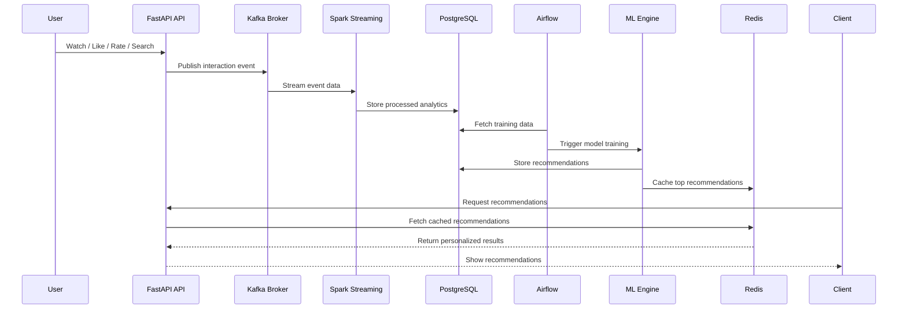
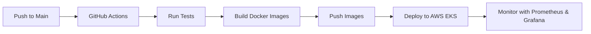

# 🎬 Real-Time AI Recommendation Platform

### Netflix / YouTube Style AI-Powered Recommendation System

<p align="center">
  <b>Production-grade real-time recommendation platform using Data Engineering, Machine Learning, Cloud, DevOps, and MLOps.</b>
</p>

<p align="center">
  <a href="https://github.com/sujoy-halder/real-time-ai-recommendation-platform">
    
  </a>
  
  
</p>

<p align="center">
  
  
  
  
  
</p>

<p align="center">
  
  
  
  
  
</p>

<p align="center">
  
  
  
  
  
</p>

---

## 📌 Project Summary

**Real-Time AI Recommendation Platform** is a production-grade, cloud-native recommendation system inspired by platforms like **Netflix**, **YouTube**, and **Amazon Prime Video**.

The system captures real-time user interactions such as **watch**, **like**, **rating**, and **search events**, processes them using a streaming data pipeline, trains machine learning models, and serves personalized recommendations through scalable APIs.

---

## 🎯 What This Project Demonstrates

This project showcases practical skills in:

| Area                         | Skills Demonstrated                                                      |
| ---------------------------- | ------------------------------------------------------------------------ |
| 🧠 Machine Learning          | Collaborative filtering, content-based filtering, neural recommendations |
| ⚡ Real-Time Data Engineering | Kafka streaming, Spark Streaming, windowed aggregations                  |
| 🏗️ Backend Engineering      | FastAPI microservices and REST APIs                                      |
| 🗄️ Database Design          | PostgreSQL schema, indexing, partitioning, materialized views            |
| 🚀 Caching                   | Redis recommendation cache and real-time stats                           |
| 🔁 Workflow Orchestration    | Airflow DAGs for model retraining and data quality checks                |
| ☁️ Cloud Engineering         | AWS EKS, RDS, ElastiCache, MSK, S3                                       |
| 🧱 Infrastructure as Code    | Terraform-based cloud provisioning                                       |
| 🐳 DevOps                    | Docker, Kubernetes, GitHub Actions                                       |
| 📊 Observability             | Prometheus, Grafana, ELK Stack                                           |
| 🔐 Security                  | JWT, rate limiting, encryption, secrets management                       |

---

🏗️ System Architecture


## 🔄 Real-Time Data Flow



---

## ✨ Key Features

### ⚡ Real-Time Event Streaming

* Captures user behavior events in real time
* Handles watch, like, rating, and search events
* Uses Kafka topics for scalable event ingestion

### 🔥 Stream Processing

* Spark Streaming for real-time event processing
* Windowed aggregations for trending content
* Real-time popularity and engagement calculation

### 🤖 Hybrid AI Recommendation Engine

* Collaborative filtering
* Content-based filtering
* Neural network embeddings
* Configurable hybrid scoring
* Real-time recommendation ranking

### 🚀 API Serving Layer

* FastAPI-based microservices
* Personalized recommendation endpoint
* Content search endpoint
* User analytics endpoint
* Trending content endpoint

### 🧠 MLOps Workflow

* Airflow-based scheduled model retraining
* Daily recommendation generation
* Model evaluation workflow
* ML experiment tracking support

### 📊 Monitoring & Observability

* Prometheus metrics
* Grafana dashboards
* ELK centralized logging
* Kafka lag monitoring
* API latency tracking

### 🔐 Production Security

* JWT authentication
* Rate limiting
* Data encryption at rest and in transit
* PostgreSQL Row-Level Security
* AWS Secrets Manager integration

---

## 🧰 Tech Stack

### Core Backend

| Technology    | Purpose                     |
| ------------- | --------------------------- |
| Python 3.11   | Main programming language   |
| FastAPI       | REST API and microservices  |
| PostgreSQL 15 | Primary relational database |
| Redis 7       | Low-latency caching         |

### Streaming & Processing

| Technology     | Purpose                     |
| -------------- | --------------------------- |
| Apache Kafka   | Event streaming platform    |
| Apache Spark   | Real-time stream processing |
| Apache Airflow | Workflow orchestration      |

### Machine Learning

| Technology           | Purpose                                  |
| -------------------- | ---------------------------------------- |
| Scikit-learn         | Classical ML models                      |
| TensorFlow / PyTorch | Deep learning recommendation models      |
| Pandas / NumPy       | Data processing and feature engineering  |
| MLflow               | Model tracking and experiment management |

### Search & Analytics

| Technology           | Purpose                                |
| -------------------- | -------------------------------------- |
| Elasticsearch        | Full-text search                       |
| PostgreSQL Analytics | Windowed analytics and reporting       |
| Redis Stats Cache    | Real-time counters and recommendations |

### DevOps & Cloud

| Technology      | Purpose                 |
| --------------- | ----------------------- |
| Docker          | Containerization        |
| Kubernetes      | Container orchestration |
| AWS EKS         | Kubernetes deployment   |
| AWS RDS         | Managed PostgreSQL      |
| AWS ElastiCache | Managed Redis           |
| AWS MSK         | Managed Kafka           |
| AWS S3          | Object storage          |
| Terraform       | Infrastructure as Code  |
| GitHub Actions  | CI/CD automation        |

### Monitoring

| Technology | Purpose                 |
| ---------- | ----------------------- |
| Prometheus | Metrics collection      |
| Grafana    | Dashboard visualization |
| ELK Stack  | Centralized logging     |

---

## 📦 Project Structure

```text
real-time-ai-recommendation-platform/
│
├── fastapi-services/
│   ├── main.py
│   ├── Dockerfile
│   └── requirements.txt
│
├── recommendation-engine/
│   ├── recommender.py
│   └── models.py
│
├── kafka-producer/
│   └── producer.py
│
├── spark-streaming/
│   ├── processor.py
│   ├── Dockerfile
│   └── requirements.txt
│
├── airflow/
│   ├── dags/
│   │   └── recommendation_dags.py
│   └── Dockerfile
│
├── database/
│   └── schema.sql
│
├── kubernetes/
│   ├── deployment.yaml
│   ├── service.yaml
│   └── hpa.yaml
│
├── terraform/
│   ├── main.tf
│   ├── variables.tf
│   └── outputs.tf
│
├── monitoring/
│   ├── prometheus.yml
│   └── logstash.conf
│
├── .github/
│   └── workflows/
│       └── deploy.yml
│
├── docker-compose-production.yml
└── README.md
```

---

## 📊 API Endpoints

### User Service

| Method | Endpoint                                | Description            |
| ------ | --------------------------------------- | ---------------------- |
| POST   | `/api/v1/users`                         | Create a new user      |
| GET    | `/api/v1/users/{user_id}`               | Get user profile       |
| GET    | `/api/v1/users/{user_id}/watch-history` | Get user watch history |

### Content Service

| Method | Endpoint                       | Description            |
| ------ | ------------------------------ | ---------------------- |
| GET    | `/api/v1/content`              | List available content |
| GET    | `/api/v1/content/{content_id}` | Get content details    |
| GET    | `/api/v1/search?q=query`       | Search content         |

### Recommendation Service

| Method | Endpoint                            | Description                      |
| ------ | ----------------------------------- | -------------------------------- |
| GET    | `/api/v1/recommendations/{user_id}` | Get personalized recommendations |
| POST   | `/api/v1/interactions`              | Record user interaction          |
| GET    | `/api/v1/trending`                  | Get trending content             |
| GET    | `/api/v1/analytics/user/{user_id}`  | Get user analytics               |

---

## 🤖 Machine Learning Models

### 1. Collaborative Filtering

Collaborative filtering recommends content based on user-item interaction patterns.

* User-based similarity
* Item-based similarity
* Matrix factorization
* Rating prediction

### 2. Content-Based Filtering

Content-based filtering recommends similar content using metadata and feature similarity.

* TF-IDF vectorization
* Cosine similarity
* Genre-based matching
* Rating and duration features

### 3. Neural Recommendation Model

Deep learning model for learning user and content embeddings.

* User embeddings
* Content embeddings
* Dense neural layers
* Dropout regularization
* Multi-task learning

### 4. Hybrid Recommendation Engine

Final recommendation score is generated by combining multiple recommendation strategies.

```text
Final Score =
    Collaborative Filtering Score * Weight A
  + Content-Based Score * Weight B
  + Neural Model Score * Weight C
  + Trending Score * Weight D
```

---

## ⚙️ Local Development Setup

### 1. Clone Repository

```bash
git clone https://github.com/sujoy-halder/real-time-ai-recommendation-platform.git
cd real-time-ai-recommendation-platform
```

### 2. Create Environment File

```bash
cp .env.example .env
```

### 3. Start Services

```bash
docker-compose -f docker-compose-production.yml up -d
```

### 4. Initialize Database

```bash
docker exec postgres-recommendation psql -U admin -d recommendations_db -f /docker-entrypoint-initdb.d/schema.sql
```

### 5. Verify Services

```bash
curl http://localhost:8000/health
curl http://localhost:3000
curl http://localhost:8888
```

---

## ☁️ Cloud Deployment

### Terraform Infrastructure Setup

```bash
cd terraform
terraform init
terraform plan
terraform apply -var-file="production.tfvars"
```

### Kubernetes Deployment

```bash
kubectl create namespace recommendation-system
kubectl apply -f kubernetes/deployment.yaml
kubectl apply -f kubernetes/hpa.yaml
```

---

## 📈 Monitoring & Observability

### Grafana Dashboards

* Real-time event throughput
* Recommendation API latency
* ML model inference time
* Kafka consumer lag
* Spark streaming delay
* Cache hit ratio
* User engagement trends
* System health status

### Prometheus Metrics

```text
recommendation_api_requests_total
recommendation_api_response_time_seconds
ml_model_inference_time_seconds
kafka_consumer_lag
spark_streaming_processing_delay_seconds
redis_cache_hit_ratio
recommendation_ctr
```

### ELK Stack Logs

* API request logs
* Kafka producer logs
* Spark processing logs
* Airflow DAG logs
* Model training logs
* Error traces

---

## 🚀 Performance Optimization

| Area       | Optimization                                   |
| ---------- | ---------------------------------------------- |
| API        | Async FastAPI endpoints and connection pooling |
| Cache      | Redis TTL-based recommendation caching         |
| Database   | Indexes on user_id, content_id, and timestamp  |
| Database   | Partitioned interaction table by date          |
| Analytics  | Materialized views for reporting               |
| Streaming  | Spark windowed aggregations                    |
| Search     | Elasticsearch full-text indexing               |
| Deployment | Kubernetes HPA autoscaling                     |

---

## 🔐 Security Features

| Security Area     | Implementation                          |
| ----------------- | --------------------------------------- |
| Authentication    | JWT-based authentication                |
| Rate Limiting     | 100 requests per minute per user        |
| Data Protection   | Encryption at rest and in transit       |
| Database Security | PostgreSQL Row-Level Security           |
| Secrets           | AWS Secrets Manager                     |
| API Protection    | Input validation and request throttling |

---

## 🧪 Testing

```bash
# Unit tests
pytest tests/unit -v

# Integration tests
pytest tests/integration -v

# Load testing
locust -f tests/load/locustfile.py --host=http://localhost:8000

# Model evaluation
python tests/ml/evaluate_models.py
```

---

## 📊 Metrics & KPIs

| Metric             | Target                 |
| ------------------ | ---------------------- |
| API p95 Latency    | < 200 ms               |
| Cache Hit Rate     | > 80%                  |
| System Uptime      | > 99.9%                |
| Data Freshness     | < 1 hour               |
| Kafka Consumer Lag | Low / Near real-time   |
| Recommendation CTR | Continuously monitored |
| Model RMSE         | Continuously optimized |

---

## 🔁 CI/CD Pipeline



---

## 🧠 Skills Highlighted

This project is designed to highlight job-ready skills for:

* Data Engineering
* Machine Learning Engineering
* Backend Engineering
* Cloud Engineering
* DevOps Engineering
* MLOps Engineering
* Real-Time Analytics
* System Design

---

## 📚 Documentation

| Document                                         | Description                      |
| ------------------------------------------------ | -------------------------------- |
| [API Documentation](./docs/api.md)               | API endpoint details             |
| [ML Models Guide](./docs/ml-models.md)           | Recommendation model explanation |
| [Deployment Guide](./docs/deployment.md)         | Local and cloud deployment       |
| [Architecture Deep Dive](./docs/architecture.md) | Complete system architecture     |

---

## 📌 Future Improvements

* Add online learning for real-time model updates
* Add A/B testing for recommendation strategies
* Add feature store integration
* Add model registry with MLflow
* Add data validation with Great Expectations
* Add blue-green deployment strategy
* Add recommendation explanation API
* Add user segmentation analytics

---

## 📄 License

This project is licensed under the **MIT License**.

---

## 👨‍💻 Author

**Sujoy Halder**

* GitHub: [sujoy-halder](https://github.com/sujoy-halder)
* Repository: [real-time-ai-recommendation-platform](https://github.com/sujoy-halder/real-time-ai-recommendation-platform)

---

<p align="center">
  <b>⭐ If you found this project useful, give it a star!</b>
</p>

<p align="center">
  <b>Built with ❤️ for Netflix-scale real-time AI recommendations</b>
</p>
